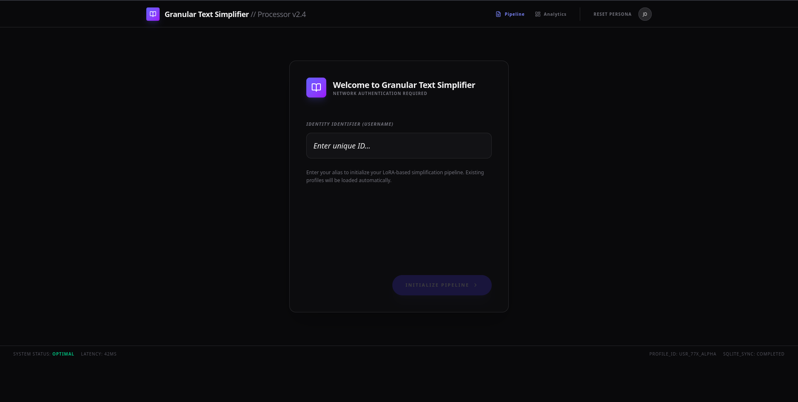
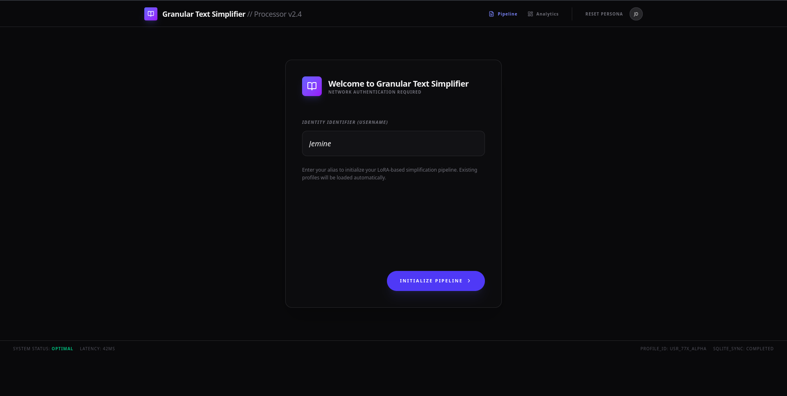
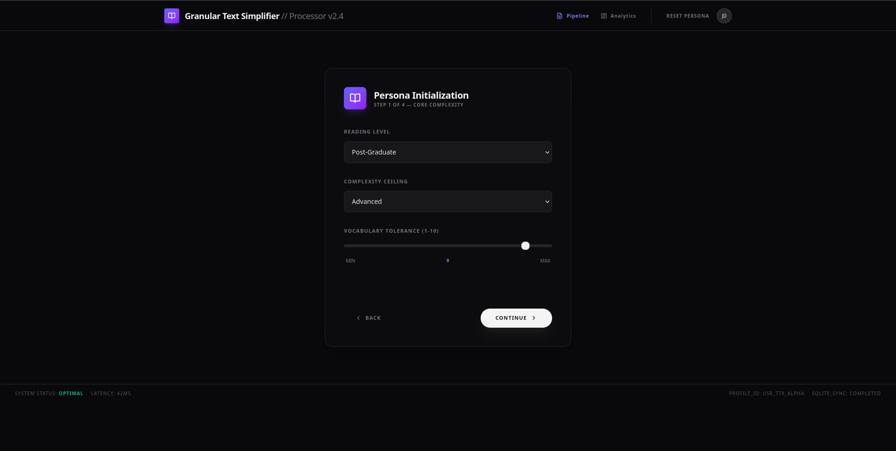
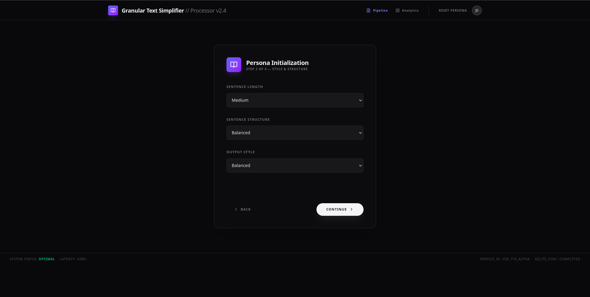
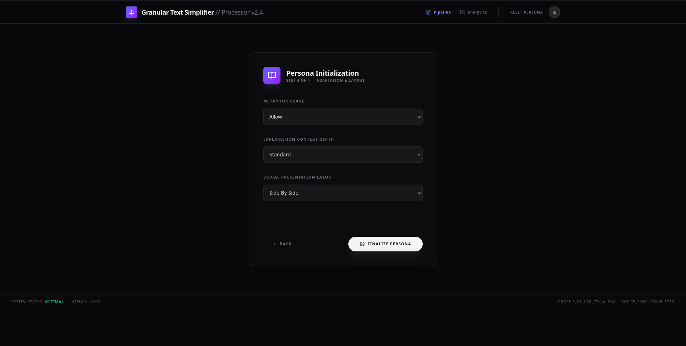
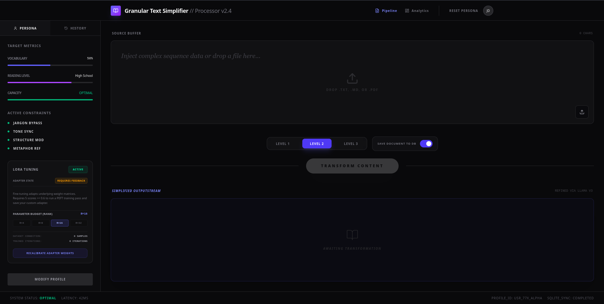

# GRANULAR TEXT SIMPLIFIER.
_A Final Year Project by [Edema Oritsejeminetemi](https://github.com/Jemine-R)_

## Tech Stack

| Layer | Technology |
|---|---|
| Frontend | React 19, TypeScript, Vite, Tailwind CSS v4 |
| Backend | Express 4, TypeScript, tsx | (BART for simplification |
| Database | SQLite (local) / PostgreSQL (production) |
| AI | Google Gemini 3 Flash |
| Deployment | Vercel (frontend) + Railway (backend + PostgreSQL) |

## Project Structure

```
text-simplifier/
├── backend/              # Express API server
│   ├── server.ts         # API routes + DB initialization
│   ├── db.ts             # Database abstraction (SQLite/PostgreSQL)
│   ├── package.json
│   ├── tsconfig.json
│   ├── Procfile
│   └── .env.example
├── docs/                 # Evaluation reports & compliance docs
├── src/                  # React frontend
│   ├── components/       # UI components (Onboarding, Simplifier, Dashboard)
│   ├── services/         # Gemini AI integration
│   ├── config.ts         # API URL configuration
│   ├── App.tsx           # Root component + routing
│   └── main.tsx          # Entry point
├── index.html            # Vite HTML entry
├── vite.config.ts
├── vercel.json
├── package.json
└── README.md
```

## How to Run

### Install frontend deps
- _pnpm install_

### Install backend deps
-  _cd backend && pnpm install_

### Start backend (port 3000)
- _cd backend && pnpm run dev_

### Start frontend (port 5173) — in a separate terminal
- _pnpm run dev_

## Environment variables

- .env @(_root_) — VITE_API_URL, GEMINI_API_KEY
- .env @(_backend_) — DATABASE_URL, PORT, NODE_ENV

## Deployment guide

- ### Railway (backend + PostgreSQL):
  1. Create Railway project
  2. Add PostgreSQL service → copy private networking URL
  3. Add backend service → root dir = /backend
  4. Set env vars: DATABASE_URL (private URL), NODE_ENV=production
  5. Build command: pnpm install, start command: pnpm start
- ### Vercel (frontend):
  1. Connect GitHub repo
  2. Framework: Vite, build: pnpm install && pnpm run build, output: dist
  3. Set env vars: VITE_API_URL=https://your-backend.up.railway.app, GEMINI_API_KEY=...
  4. Deploy


## Media







